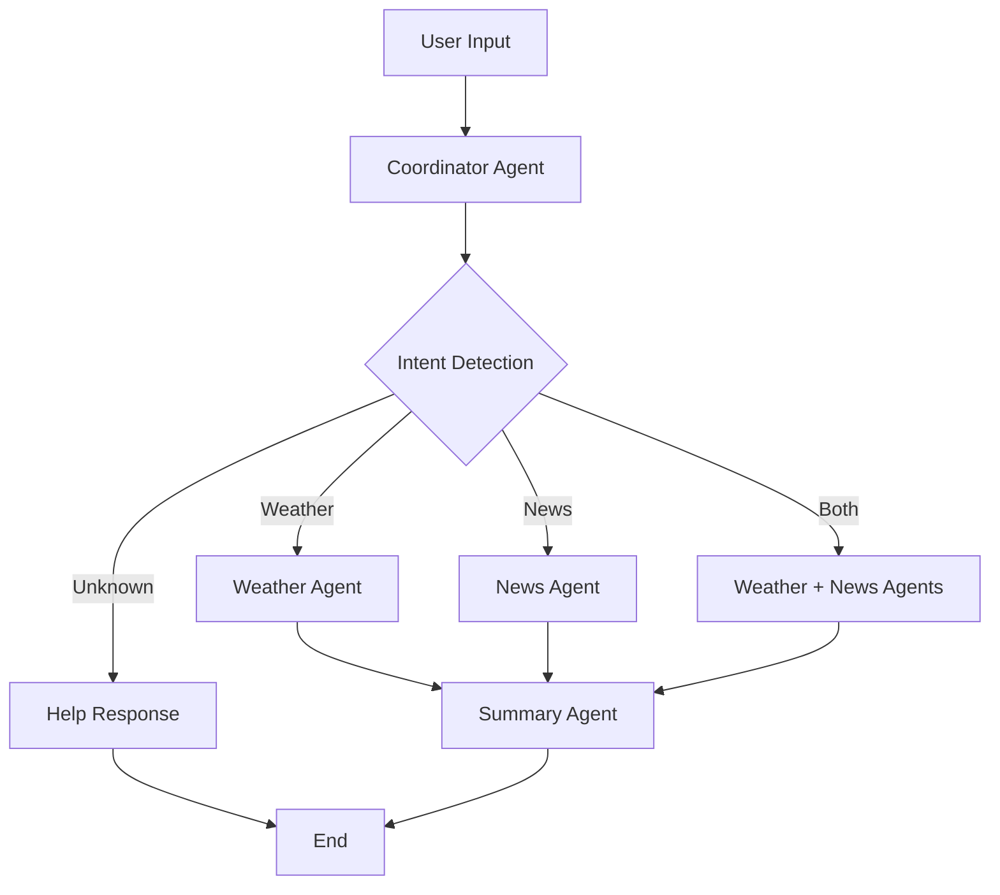

# LangGraph Multi-Agent Research System 🌤️📰

A lightweight multi-agent research system built with LangGraph that combines weather and news intelligence. This project demonstrates agent orchestration, conditional routing, and state management patterns suitable for learning and extension. It uses LLM-powered agents plus web-search tools to provide location-aware weather and news summaries.

## 🚀 Quick Start

```bash
# 1. Create and activate a virtual environment
python -m venv .venv
source .venv/bin/activate    # On Windows: .venv\Scripts\activate

# 2. Install dependencies
pip install -r requirements.txt

# 3. Set up API keys (recommended in .env)
echo "GOOGLE_API_KEY=your_google_gemini_key_here" >> .env
echo "SERPAPI_API_KEY=your_serpapi_key_here" >> .env

# 4. Run the application
python main.py
```

Notes:
- `config.py` will prompt for `GOOGLE_API_KEY` if not set. `SERPAPI_API_KEY` is required for web search functionality (news & weather lookups).
- Use `demo.py` to run canned test cases without interactive input:
```bash
python demo.py
```

## 🏗️ Architecture Overview

Repository layout
```
langgraph_example/
├── main.py          # Application entry point & CLI
├── config.py        # Environment & API key setup
├── state.py         # Type-safe state definitions
├── agents.py        # LLM-powered agent implementations
├── tools.py         # Search tools (SerpAPI)
├── graph.py         # Conditional routing & orchestration
├── demo.py          # Demo/test script
└── weather.py       # Deprecated legacy reference
```

Agent flow (high-level)


## ⭐ Key Features

- Smart intent detection (weather, news, both)
- Conditional execution to reduce unnecessary API calls
- LLM-powered agents for natural, contextual responses
- SerpAPI-backed search tools for weather and news results
- Type-safe state management and modular design
- Graceful error handling and fallback messages

##  Usage Examples

Weather-only:
```
Location: San Francisco, CA
Query: what's the weather like?

Result: Currently 68°F and partly cloudy in San Francisco. Light winds from the west at 8 mph.
```

News-only:
```
Location: New York, NY
Query: latest news

Result: Recent headlines for New York:
• NYC Subway Expansion Approved (NY Times)
  $15B project will add 3 new lines by 2027
• Broadway Shows Return Post-Strike (AP)
  Full schedule resuming this weekend
```

Combined:
```
Location: Miami, FL
Query: weather and news

Result: 🌤️ WEATHER: Currently 82°F and sunny with high humidity.
        📰 NEWS: Hurricane season preparations underway; local tech hub opens.
```

## 🔧 Setup Guide

### Prerequisites
- Python 3.8+
- Virtual environment (recommended)
- Valid API keys:
  - GOOGLE_API_KEY — For LLM/model usage (Gemini)
  - SERPAPI_API_KEY — For web search (news & weather)

### Environment Setup
1. Clone and enter project:
```bash
git clone https://github.com/mario-guerra/langgraph_example.git
cd langgraph_example
```
2. Create virtual env and install:
```bash
python -m venv .venv
source .venv/bin/activate
pip install -r requirements.txt
```
3. Add API keys to `.env` or allow `config.py` to prompt:
```env
GOOGLE_API_KEY=your_google_gemini_key_here
SERPAPI_API_KEY=your_serpapi_key_here
```

## 🧪 Testing

Manual:
- Run `python main.py` and try queries: "weather", "news", "weather and news".

Automated demo:
```bash
python demo.py
```

Component checks:
```bash
python -c "from graph import create_research_graph; print('✅ Graph builds successfully')"
python -c "from agents import coordinator_agent; print('✅ Agents import successfully')"
python -c "from tools import weather_search; print('✅ Tools import successfully')"
```

## 🏛️ Technical Details

Agent responsibilities:
- Coordinator: intent detection, location resolution, routing
- Weather agent: SerpAPI weather search + LLM formatting
- News agent: News-specific SerpAPI search + LLM formatting
- Summary agent: Synthesis and final LLM formatting

State (see `state.py`):
- messages: conversation history
- location: resolved location string
- intent: "weather" | "news" | "both" | "unknown"
- weather_data, news_data: agent outputs

Tools:
- `tools.py` contains `weather_search`, `news_search`, `resolve_location` implemented with SerpAPI.

## 🔄 Legacy / Deprecated

`weather.py` is kept as a reference for the legacy approach and is marked DEPRECATED. Historical refactor rationale and implementation notes can be found in the repository history and commit messages.

## 🔍 Troubleshooting

Common issues:
- "Module not found": ensure virtualenv is active and dependencies installed.
- "API key not found": verify keys in `.env` or set them in the environment.
- No search results: check SerpAPI quota and try more specific location names.

Useful commands:
```bash
# Show .env contents
cat .env

# Run demo tests
python demo.py
```

## 🧾 Dependencies

See `requirements.txt` (high-level):
- langchain-core, langchain, langgraph
- langchain-google-genai
- python-dotenv
- google-search-results (SerpAPI client)

## 🔮 Future Enhancements

- Add more agents (sports, finance)
- Better location resolution via geocoding
- Caching (Redis) and rate limiting
- Async/parallel agent execution
- Web UI (FastAPI / Streamlit)
- Observability and monitoring

## 📝 License

MIT License — Free for learning and experimentation.

---

Changelog: Restored lost intro, fixed truncated/duplicated lines, clarified setup and demo instructions, and preserved original tone.
