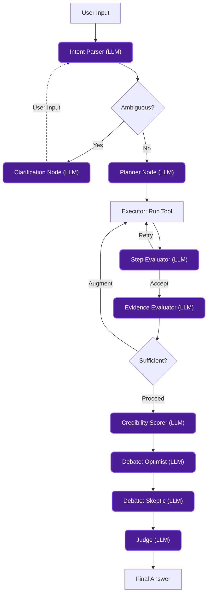

# OrchidTrace LangGraph Integration Example 🧠🔍

This repository serves as a reference implementation demonstrating how to integrate the **OrchidTrace debugger** with a production-grade, stateful "Plan-Execute" research framework built with LangGraph. 

By integrating `orchid-sdk`, we are able to capture, inspect, and replay the complex, cyclical execution graph of this Tri-Model Adversarial Architecture (using OpenAI, Anthropic, and Google Vertex AI).

## 🚀 Quick Start

To see the Orchid capture mode in action, run the demo script:

```bash
# 1. Create and activate a virtual environment
python -m venv .venv
source .venv/bin/activate    # On Windows: .venv\Scripts\activate

# 2. Install dependencies (includes orchid-sdk)
pip install -r requirements.txt

# 3. Authenticate with Google Cloud (for Vertex AI)
gcloud auth application-default login

# 4. Set up API keys in .env
echo "SERPAPI_API_KEY=your_serpapi_key_here" >> .env
echo "OPENAI_API_KEY=your_openai_key_here" >> .env
echo "ANTHROPIC_API_KEY=your_anthropic_key_here" >> .env

# 5. Run the Orchid demo
python orchid_demo.py
```

*Note: The `orchid_demo.py` script executes a suite of automated test cases with Orchid capture mode enabled via `import orchid; orchid.init()`.*

## 🏗️ Architecture Overview

Unlike traditional DAGs, this system uses a dynamic, cyclical **Plan-Execute** architecture. The graph routes intelligently based on the LLM's own uncertainty and evaluation signals. OrchidTrace is used to debug these dynamic routing decisions.


```mermaid
graph TD
  classDef llmNode fill:#4c1d95,stroke:#8b5cf6,stroke-width:2px,color:#ffffff,rx:8px,ry:8px;

  A["User Input"] --> B["Intent Parser (LLM)"]:::llmNode
  B --> C{"Ambiguous?"}
  C -->|Yes| D["Clarification Node (LLM)"]:::llmNode
  D -.->|"User Input"| B
  C -->|No| E["Planner Node (LLM)"]:::llmNode
  E --> F["Executor: Run Tool"]
  F --> G["Step Evaluator (LLM)"]:::llmNode
  G -->|Retry| F
  G -->|Accept| H["Evidence Evaluator (LLM)"]:::llmNode
  H --> I{"Sufficient?"}
  I -->|Augment| F
  I -->|Proceed| J["Credibility Scorer (LLM)"]:::llmNode
  J --> K["Debate: Optimist (LLM)"]:::llmNode
  K --> L["Debate: Skeptic (LLM)"]:::llmNode
  L --> M["Judge (LLM)"]:::llmNode
  M --> N["Final Answer"]
```

## 📁 Repository Layout

```
langgraph_example/
├── orchid_demo.py   # Automated integration tests with Orchid capture mode enabled
├── main.py          # Interactive CLI with real-time state streaming
├── graph.py         # Dynamic graph routing and orchestration
├── state.py         # Complex AgentState definitions
├── schemas.py       # Pydantic models enforcing strict LLM structured outputs
├── agents.py        # Intent, Clarification, Executor, and Evaluator nodes
├── planner.py       # Autonomous research planning node
├── credibility.py   # Source credibility scoring engine
├── debate.py        # Optimist, Skeptic, and Judge nodes
├── utils.py         # LLM utilities (e.g., auto-correcting validation loops)
├── llm.py           # Centralized Vertex AI model initialization
└── tools.py         # Tool registry (SerpAPI web, news, weather search)
```

## 🔧 Setup & Dependencies

### Prerequisites
- Python 3.11+
- Google Cloud Platform account (with Vertex AI enabled)
- `gcloud` CLI installed and authenticated
- SerpAPI key
- OpenAI API key
- Anthropic API key

### API Keys & Auth
1. **Vertex AI**: We use `langchain-google-vertexai`. Ensure you have authenticated locally via `gcloud auth application-default login` and set your quota project.
2. **SerpAPI, OpenAI, & Anthropic**: Create a `.env` file and add:
   ```env
   SERPAPI_API_KEY=your_key_here
   OPENAI_API_KEY=your_openai_key_here
   ANTHROPIC_API_KEY=your_anthropic_key_here
   ```

## 🔍 Troubleshooting

- **ModuleNotFoundError: No module named 'orchid'**: Ensure you have run `pip install -r requirements.txt` to install the `orchid-sdk`.
- **429 RESOURCE_EXHAUSTED / NOT_FOUND**: This indicates a Google API issue. Ensure you are authenticated via `gcloud auth application-default login`.
- **Missing SerpAPI Key**: The Executor will safely catch the missing key and return an error string, but no actual research will occur. Add it to your `.env`.

## 📝 License

MIT License — Free for learning, refactoring, and agentic experimentation.
