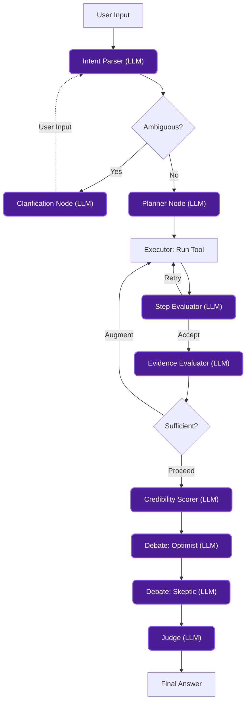

# Adaptive Multi-Agent Research System 🧠🔍

A production-grade, stateful "Plan-Execute" research framework built with LangGraph. Powered by a **Tri-Model Adversarial Architecture** utilizing OpenAI (`o3-mini`), Anthropic (`claude-3.5-sonnet-latest`), and Google Vertex AI (`gemini-2.5-flash`). This project demonstrates advanced agentic patterns, moving beyond static routing to dynamic, uncertainty-driven research loops. It features autonomous planning, structured LLM reasoning, credibility scoring, and an adversarial debate pipeline to produce highly calibrated answers.

## 🚀 Quick Start

```bash
# 1. Create and activate a virtual environment
python -m venv .venv
source .venv/bin/activate    # On Windows: .venv\Scripts\activate

# 2. Install dependencies
pip install -r requirements.txt

# 3. Authenticate with Google Cloud (for Vertex AI)
gcloud auth application-default login

# 4. Set up SerpAPI key in .env
echo "SERPAPI_API_KEY=your_serpapi_key_here" >> .env

# 5. Run the interactive CLI
python main.py
```

*Note: You can also run `python demo.py` to execute a suite of automated test cases (including complex ambiguity resolution).*

## 🏗️ Architecture Overview

Unlike traditional DAGs, this system uses a dynamic, cyclical **Plan-Execute** architecture. The graph routes intelligently based on the LLM's own uncertainty and evaluation signals.


```mermaid
graph TD
  classDef llmNode fill:#4c1d95,stroke:#8b5cf6,stroke-width:2px,color:#ffffff,rx:8px,ry:8px;

  A["User Input"] --> B["Intent Parser (LLM)"]:::llmNode
  B --> C{"Ambiguous?"}
  C -->|Yes| D["Clarification Node (LLM)"]:::llmNode
  D -.->|"User Input"| B
  C -->|No| E["Planner Node (LLM)"]:::llmNode
  E --> F["Executor: Run Tool"]
  F --> G["Step Evaluator (LLM)"]:::llmNode
  G -->|Retry| F
  G -->|Accept| H["Evidence Evaluator (LLM)"]:::llmNode
  H --> I{"Sufficient?"}
  I -->|Augment| F
  I -->|Proceed| J["Credibility Scorer (LLM)"]:::llmNode
  J --> K["Debate: Optimist (LLM)"]:::llmNode
  K --> L["Debate: Skeptic (LLM)"]:::llmNode
  L --> M["Judge (LLM)"]:::llmNode
  M --> N["Final Answer"]
```

### Core Pipeline Phases:
1. **Intent & Clarification**: Parses user intent. If the query is genuinely ambiguous, it pauses execution, prompts the user for clarification, and resumes once answered.
2. **Plan & Execute**: The Planner generates a `ResearchPlan` (Pydantic schema). The Executor iterates through steps, automatically retrying failed or low-quality search results.
3. **Uncertainty Loops**: The Evidence Evaluator audits collected data. If it detects coverage gaps or contradictions, it can autonomously append new steps to the plan and send execution back to the Executor.
4. **Debate & Synthesis**: 
   - **Credibility Scorer**: Rates every data source on authority, recency, and relevance.
   - **Optimist**: Drafts the best-case argument from the evidence.
   - **Skeptic**: Rigorously challenges the optimist's claims, pointing out gaps or low-credibility sources.
   - **Judge**: Synthesizes the debate into a final, highly-calibrated verdict.

## 📁 Repository Layout

```
langgraph_example/
├── main.py          # Interactive CLI with real-time state streaming
├── demo.py          # Automated integration tests
├── graph.py         # Dynamic graph routing and orchestration
├── state.py         # Complex AgentState definitions
├── schemas.py       # Pydantic models enforcing strict LLM structured outputs
├── agents.py        # Intent, Clarification, Executor, and Evaluator nodes
├── planner.py       # Autonomous research planning node
├── credibility.py   # Source credibility scoring engine
├── debate.py        # Optimist, Skeptic, and Judge nodes
├── utils.py         # LLM utilities (e.g., auto-correcting validation loops)
├── llm.py           # Centralized Vertex AI model initialization
└── tools.py         # Tool registry (SerpAPI web, news, weather search)
```

## ⭐ Key Engineering Features

- **Strict Structured Outputs**: Every single LLM node outputs rigidly defined Pydantic schemas. 
- **Auto-Correction Loops**: If the LLM generates invalid JSON or violates the Pydantic schema, the `invoke_structured` utility catches the `ValidationError` and feeds it back to the LLM to force a correction before crashing.
- **Cross-Agent Signaling**: Agents communicate via a shared `scratchpad` using a publish-subscribe signal pattern (e.g., the Evidence Evaluator leaves "flag_finding" signals for the Judge).
- **Streaming Observability**: The CLI uses `stream_mode=["messages", "updates"]` to provide granular, real-time logging of internal node executions, allowing users to watch the agent "think".
- **Tri-Model Adversarial Architecture**: The system weaponizes the unique strengths of the three major frontier models against each other:
  - **OpenAI `o3-mini` (The Architect & Advocate)**: Powers the `Planner` and `Optimist` nodes. Its internal RL-based chain-of-thought makes it unmatched at complex multi-step research decomposition, while its confident synthesis style is perfect for building the strongest possible affirmative case.
  - **Anthropic `claude-3.5-sonnet-latest` (The Critic & Arbiter)**: Powers the `Skeptic`, `Evidence Evaluator`, and `Judge` nodes. Claude's inherent caution and pedantry make it the ultimate "red team." It ruthlessly spots logical fallacies in the Optimist's argument and delivers perfectly calibrated, hallucination-free final verdicts.
  - **Google `gemini-2.5-flash` (The Workhorse)**: Powers the `Intent Parser`, `Executor`, and `Credibility Scorer`. Flash’s massive context window and ultra-low latency make it the ideal engine to grind through high-volume, repetitive evaluation loops without bottlenecking the pipeline.

## 🔧 Setup & Dependencies

### Prerequisites
- Python 3.11+
- Google Cloud Platform account (with Vertex AI enabled)
- `gcloud` CLI installed and authenticated
- SerpAPI key

### API Keys & Auth
1. **Vertex AI**: We use `langchain-google-vertexai`. Ensure you have authenticated locally via `gcloud auth application-default login` and set your quota project.
2. **SerpAPI**: Create a `.env` file and add `SERPAPI_API_KEY=your_key_here`.

## 🔍 Troubleshooting

- **429 RESOURCE_EXHAUSTED / NOT_FOUND**: This indicates a Google API issue. Ensure you are authenticated via `gcloud auth application-default login` and that your GCP project has the Vertex AI API enabled.
- **Missing SerpAPI Key**: The Executor will safely catch the missing key and return an error string, but no actual research will occur. Add it to your `.env`.
- **Hanging Execution**: If the graph seems to pause for a long time at `credibility`, this is normal! The credibility node runs sequential LLM evaluation calls against every search result.

## 📝 License

MIT License — Free for learning, refactoring, and agentic experimentation.
